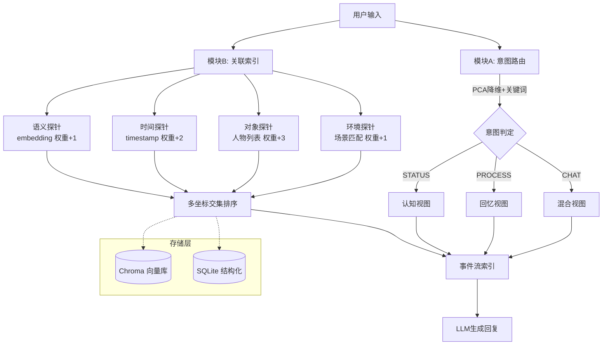

# 河 (The River) — AstrBot RP 记忆系统

> **记忆即状态，索引即认知。没有外部状态表。**

[](https://python.org)
[](LICENSE)
[](test_demo.py)

**作者**: [容心](https://github.com/Crino9999) | **实现**: 铃兰 & 小九 | **版本**: 0.1.0

---

## 这是什么

River 是为 AstrBot 角色扮演设计的记忆检索系统。它回答了传统 RAG（检索增强生成）无法回答的三个问题：

| 痛点 | 传统RAG的问题 | River的解法 |
|------|-------------|------------|
| **承诺与未来** | "今天天气不错"永远找不到"欠你100块" | 物理坐标关联索引（时间+对象+环境探针） |
| **因果顺序** | 承诺→等待→成功，检索时平铺不分先后 | 事件流 + 认知/回忆双视图 |
| **记忆串线** | 欠A的钱和欠B的钱在向量空间重叠 | 对象坐标隔离 + 事件流分组 |

## 架构



## 核心模块

| 模块 | 文件 | 职责 |
|------|------|------|
| **数据模型** | `core/memory.py` | Memory + EventStream 数据结构 |
| **意图路由** | `core/intent.py` | PCA降维分类 STATUS/PROCESS/CHAT |
| **关联索引** | `core/associative.py` | 四路探针并行检索 + 交集排序 |
| **事件流** | `core/eventstream.py` | 认知/回忆/混合三视图 |
| **存储层** | `core/store.py` | Chroma向量库 + SQLite，纯离线 |

## 快速开始

```bash
# 1. 克隆仓库
git clone https://github.com/Crino9999/river-memory.git
cd river-memory

# 2. 安装依赖
pip install chromadb scikit-learn

# 3. 运行测试（4个场景，全通过）
python test_demo.py
```

**零网络依赖** — 使用 TF-IDF + PCA，不需要下载任何模型。

## 测试结果

```
==================================================
场景一：欠钱提醒 (关联索引)
==================================================
输入: 今天天气不错。
命中记忆: [('m001', 6)]  ← 欠A 100块 得分最高
PASS: A会提醒你还钱

==================================================
场景二：治角状态查询 (认知视图)
==================================================
输入: 我看看恢复得如何。
返回记忆: ['m004']  ← 只返回"治愈成功"
PASS: 蕾姆说角已经好了

--- 过程查询 (回忆视图) ---
输入: 还记得我是怎么治好的吗？
返回记忆: ['m002', 'm003', 'm004']  ← 完整3条链
PASS: 蕾姆回忆了整个治疗过程

==================================================
场景三：闲聊混合视图 (CHAT)
==================================================
输入: 今天好累。
返回记忆: ['m003', 'm004']  ← 熬夜查资料 + 最新状态
PASS: 蕾姆想起先生熬夜查资料的样子

全部4个测试场景通过！
```

## 使用方式

```python
from core.store import MemoryStore
from core.memory import Memory
from main import recall

# 初始化
store = MemoryStore()

# 入库一条记忆（带物理坐标）
store.add(Memory("m001", "我答应在1.20还A 100块。",
    timestamp="2026-01-01",
    event_stream_id="evt_debt_A",
    objects=["A"],           # ← 对象坐标
    environment="厨房",       # ← 环境坐标
    status_update="欠A 100块"))

# 检索（自动意图路由 + 关联索引 + 事件流视图）
response = recall(
    user_input="今天天气不错。",
    current_date="2026-01-20",
    present_people=["A"],
    current_env="客厅",
    store=store,
)
```

## 技术栈

| 组件 | 选型 | 原因 |
|------|------|------|
| 向量数据库 | Chroma | 嵌入式、零配置、Python原生 |
| 结构化存储 | SQLite | 无处不在、零运维 |
| 嵌入 | TF-IDF (sklearn) | 纯离线、无需GPU、秒级加载 |
| 意图分类 | PCA + sklearn | 轻量、可解释 |
| 语言 | Python 3.10+ | 生态丰富、AstrBot兼容 |

## 与 Hindsight 的关系

**互补，不是替代。**

| | Hindsight | River |
|---|---|---|
| 定位 | 底层全量记忆 | 上游结构化检索 |
| 检索方式 | 纯语义向量 | 语义+物理坐标+事件流 |
| 擅长的场景 | "我记得聊过这个" | "在正确的时间想起正确的事" |

> River 作为上游检索层，Hindsight 做底层全量语义匹配兜底。

## Roadmap

- [x] 物理坐标关联索引（时间+对象+环境）
- [x] 事件流 & 认知/回忆/混合三视图
- [x] PCA 意图路由
- [x] 纯离线嵌入（TF-IDF + jieba分词）
- [x] 4场景测试通过
- [x] LLM 物理坐标提取 (core/ingestor.py)
- [x] 事件流归属判定 (core/ingestor.py)
- [x] MemoryIngestor 入库流程
- [x] ConversationManager 会话管理 (core/conversation.py)
- [x] 时间表达式解析 (core/time_parser.py)
- [x] AstrBot 插件适配器 (astrbot_plugin/)
- [x] 配置外部化 (.env + python-dotenv)
- [x] 结构化日志 (core/logger.py)
- [x] 角色系统指令管理 (config/characters/)
- [ ] `due_at` / `trigger_at` 到期时间字段
- [ ] 复杂RP场景（误会/梦境/复发/反转/取消承诺）
- [ ] 真实 Embedding 模型替换 TF-IDF
- [ ] 集成端到端测试覆盖所有设计文档场景
- [ ] 压力测试 & 边界测试

## 版本历史

### v0.2.0 (2026-05-26) — opencode 实现 MVP 核心模块

**新增模块**：
- `core/ingestor.py` — LLM 物理坐标提取 + 事件流归属判定 + MemoryIngestor（Phase 2 核心）
- `core/conversation.py` — ConversationManager 多会话/多用户管理
- `core/time_parser.py` — 中文时间表达式解析（"明天"→日期、"下周"→日期+7）
- `core/logger.py` — 结构化日志，按级别输出
- `astrbot_plugin/` — AstrBot 标准插件适配器
- `scripts/import_history.py` — 从 JSON/CSV 批量导入历史对话
- `config/characters/rem.json` — 蕾姆角色配置模板
- `demo.py` — 端到端演示（Ingestor + recall）
- `.env.example` — 配置模板（API地址、模型、探针权重、日志级别）

**更新模块**：
- `config.py` — 集成 python-dotenv、探针权重可配置、日志配置
- `main.py` — 集成 Ingestor + ConversationManager
- `associative.py` — 日期模糊匹配、对象别名匹配
- `intent.py` — 多角色意图识别
- `SKILL.md` — 更新架构图和 API 文档
- `requirements.txt` — 添加 jieba、python-dotenv 等依赖

**修复**：
- TF-IDF 固定坐标系（预 fit 种子语料，只 transform 不 refit）
- jieba 中文分词（解决中文被当成单字符大 token 的问题）
- HitResult 来源追踪（替代奇偶推断判断语义命中）

### v0.1.0 (2026-05-25) — 铃兰手搓 PoC

- 双索引体系原型实现（关联索引 + 事件流三视图）
- 4 场景测试全部通过
- TF-IDF + Chroma + SQLite 纯离线存储

## License

MIT © 容心 (Crino9999)
